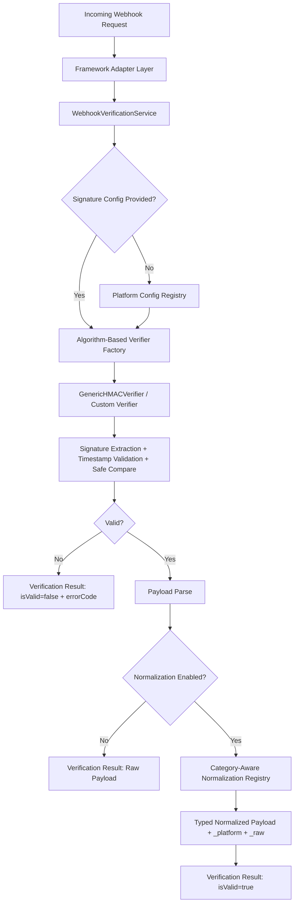
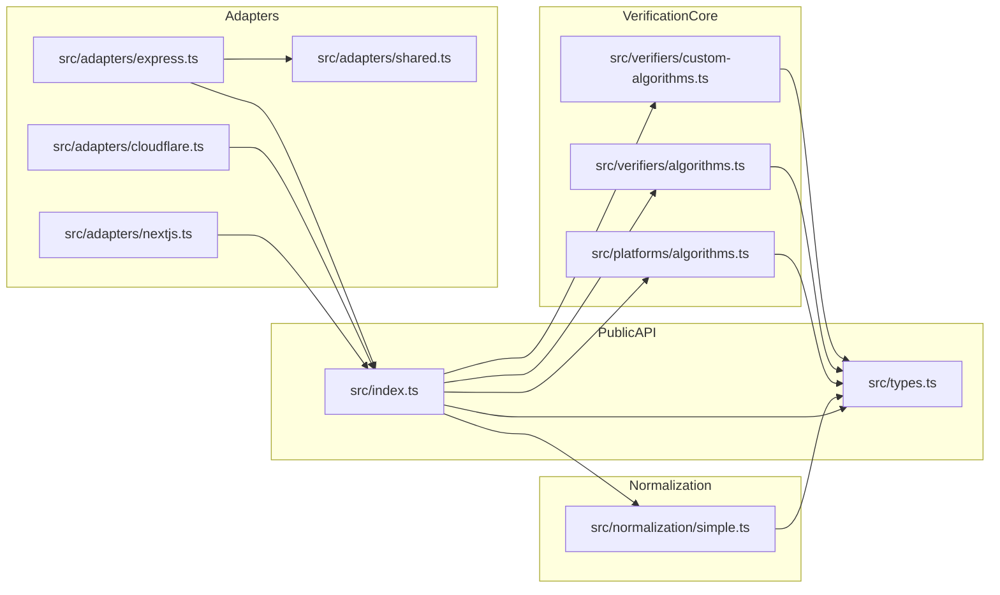
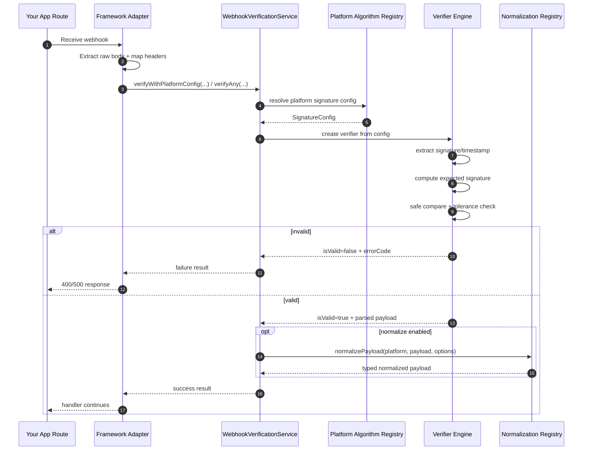

# Tern Architecture & Platform Feature Guide

This document explains Tern as an **"Axios for webhook verification"**: a unified API over many provider-specific signature schemes and payload formats.

---

## 1) High-Level Architecture

### Key Layers

1. **Framework Adapters** (`express`, `nextjs`, `cloudflare`)
   - Converts framework-native request shapes to Web `Request`.
   - Handles raw-body extraction safely for signature verification.

2. **Verification Service**
   - Main public entrypoint.
   - Supports:
     - `verify()` (full config)
     - `verifyWithPlatformConfig()` (easy mode)
     - `verifyAny()` (multi-provider detection/verification)

3. **Verifier Engines**
   - `GenericHMACVerifier`: shared logic for HMAC families.
   - `TokenBasedVerifier`: custom/token style verifications.

4. **Platform Algorithm Registry**
   - Declarative config per provider:
     - header name/format
     - payload signing shape
     - timestamp behavior
     - algorithm mapping

5. **Normalization Registry**
   - Category-aware normalization (`payment`, `auth`, `ecommerce`, `infrastructure`).
   - Produces strongly-typed normalized shapes and migration-safe fields.

6. **Foundational Error Taxonomy**
   - Stable error codes for deterministic handling:
     - `MISSING_SIGNATURE`
     - `INVALID_SIGNATURE`
     - `TIMESTAMP_EXPIRED`
     - `MISSING_TOKEN`
     - `INVALID_TOKEN`
     - `VERIFICATION_ERROR`
     - plus reserved/foundation codes for platform/normalization failures.

---

## 2) Internal Module Map

---

## 3) Request Lifecycle (Detailed)

---

## 4) Platform Support Matrix (Current)

| Platform | Verification Mode | Signature/Token Header | Algorithm/Mechanism | Timestamp Strategy | Normalization Category | Notes |
|---|---|---|---|---|---|---|
| Stripe | Signature | `stripe-signature` | HMAC-SHA256 | Embedded in signature (`t=...`) | `payment` | Supports normalized payment shape |
| GitHub | Signature | `x-hub-signature-256` | HMAC-SHA256 with `sha256=` prefix | None | (raw/fallback) | Strong verifier support |
| Clerk | Signature | `svix-signature` | HMAC-SHA256 (base64 secret derivation) | `svix-timestamp` | `auth` | Svix-style payload format |
| Dodo Payments | Signature | `webhook-signature` | HMAC-SHA256 (svix-style/base64) | `webhook-timestamp` | (raw/fallback) | Verifier implemented |
| Shopify | Signature | `x-shopify-hmac-sha256` | HMAC-SHA256 | none/custom | (raw/fallback) | Platform config present |
| Vercel | Signature | `x-vercel-signature` | HMAC-SHA256 | `x-vercel-timestamp` | `infrastructure` | Typed normalization present |
| Polar | Signature | `x-polar-signature` | HMAC-SHA256 | `x-polar-timestamp` | `payment` | Typed normalization present |
| Supabase | Token | `x-webhook-token` (+ `x-webhook-id`) | token compare (custom) | N/A | `auth` | Typed normalization present |
| GitLab | Token | `X-Gitlab-Token` | token compare (custom) | N/A | (raw/fallback) | Verifier implemented |
| Custom/Unknown | Configurable | user-defined | configurable | configurable | fallback | Extension path for new platforms |

---

## 5) Normalization Categories (Current Typed Models)

### Payment (`PaymentWebhookNormalized`)
- Standardized fields include:
  - `event` (`payment.succeeded`, etc.)
  - `amount`, `currency`
  - `customer_id`, `transaction_id`
  - `metadata`, `occurred_at`
  - `_platform`, `_raw`

### Auth (`AuthWebhookNormalized`)
- Standardized fields include:
  - `event` (`user.created`, etc.)
  - `user_id`, `email`, `phone`
  - `metadata`, `occurred_at`
  - `_platform`, `_raw`

### Infrastructure (`InfrastructureWebhookNormalized`)
- Standardized fields include:
  - `event`
  - `project_id`, `deployment_id`, `status`
  - `metadata`, `occurred_at`
  - `_platform`, `_raw`

### Ecommerce
- Typed interface defined for schema consistency.
- Platform-specific normalizers can be added incrementally.

---

## 6) Foundational Error Taxonomy

Tern now returns a machine-readable `errorCode` for deterministic handling and observability.

| Error Code | Meaning | Typical Action |
|---|---|---|
| `MISSING_SIGNATURE` | Required signature header missing | Return `400`, inspect middleware/body parsing |
| `INVALID_SIGNATURE` | Signature mismatch | Return `400`, audit secrets/incoming body integrity |
| `TIMESTAMP_EXPIRED` | Signed request outside tolerance window | Return `400`, sync clock + check retries |
| `MISSING_TOKEN` | Token header absent for token-based platform | Return `400`, validate sender config |
| `INVALID_TOKEN` | Token mismatch | Return `400`, rotate/check tokens |
| `VERIFICATION_ERROR` | Catch-all verification failure | Return `500/400` depending on context |
| `PLATFORM_NOT_SUPPORTED` | Reserved foundation for unsupported platform | return safe error / fallback path |
| `NORMALIZATION_ERROR` | Reserved foundation for mapping failures | fallback to raw payload |

---

## 7) Framework Adapters: What They Solve

### Express Adapter
- Solves body-parser pitfalls by preserving a raw-body path before verification.
- Attaches verified result to request object (`req.webhook`).

### Next.js Adapter
- Provides minimal route-handler wrapper with consistent JSON responses.
- Keeps verification logic out of route handler business logic.

### Cloudflare Adapter
- Handles edge request semantics + env-based secret retrieval (`secretEnv`).
- Keeps same core verification API semantics as Node adapters.

---

## 8) Extension Blueprint (How to Add a Platform)

1. Add verification config in `src/platforms/algorithms.ts`.
2. If custom logic is needed, extend custom verifier path.
3. Add normalization spec in `src/normalization/simple.ts` with category assignment.
4. Add tests in `src/test.ts`:
   - valid signature/token
   - invalid signature/token
   - missing header
   - normalization shape checks
5. Add docs entry to matrix and usage examples.

---

## 9) Product Geist (TL;DR)

Tern is designed as:
- **One verification API** across many providers.
- **One normalization contract** per business category.
- **One adapter model** across server/runtime frameworks.

This gives teams migration leverage and consistent webhook handling with minimal dependency and minimal per-provider lock-in.
